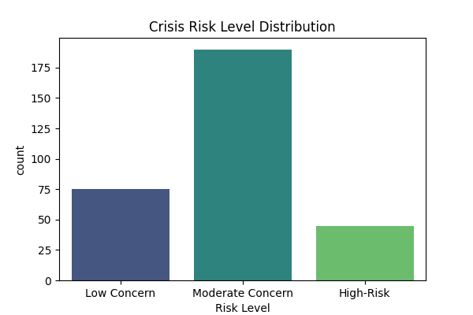
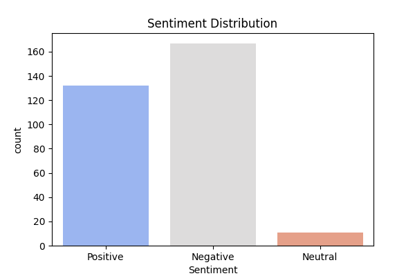

# Dr.-AI

## Overview
This project analyzes crisis-related discussions using **Natural Language Processing (NLP)**, **machine learning**, and **geospatial visualization**. It extracts key crisis-related insights from text data and maps them to visualize regional distress patterns.

## Tasks & Solutions

### Task 1: Data Cleaning & Preprocessing
- **Goal:** Prepare raw Reddit posts for analysis as `data/raw_reddit_posts.csv`.
- **Approach:**
  - Removed duplicates and irrelevant content.
  - Standardized text (lowercasing, punctuation removal, stopword filtering, emojy removal).
  - Saved the cleaned dataset as `data/cleaned_reddit_posts.csv`.

### Task 2: Crisis Classification
- **Goal:** Identify crisis-related posts.
- **Approach:**
  - Used a **pretrained BERT model** for text classification.
  - Applied fine-tuning for crisis-related categories.
  - Saved classified results in `data/classified_reddit_posts.csv` and `data/sentiment_and_crisis_results.json`.
  - Saved results as:
    - `figures/Crisis Risk Level Distribution.png`
    - `figures/sentiment_distribution.png`

### Task 3: Crisis Geolocation & Mapping
- **Goal:** Extract location mentions and visualize crisis discussions on a map.
- **Approach:**
  - Used **spaCy NLP** to extract location names from text.
  - Geocoded locations with **Geopy (Nominatim API)**.
  - Generated a heatmap using **Folium**.
  - Displayed the **top 5 locations** with the highest crisis discussions.
  - Saved results as:
    - `htmls/crisis_heatmap.html` (heatmap visualization)
    - `htmls/crisis_heatmap_with_top_5_locations.html` (with markers)


## Installation & Usage
1. **Install dependencies:**  
   ```sh
   pip install -r requirements.txt

2. **Run the analysis pipeline:** 
- python task1_data_cleaning.py
- python task2_crisis_classification.py
- python task3_geolocation.py

## Results
### Task 2



### Task 3
[View Heatmap of Crisis Discussions](https://github.com/mobinamb/Dr.-AI/blob/main/htmls/crisis_heatmap.html)

[View Heatmap of Top 5 Crisis Discussions](https://github.com/mobinamb/Dr.-AI/blob/main/htmls/crisis_heatmap_with_top_5_locations.html)


